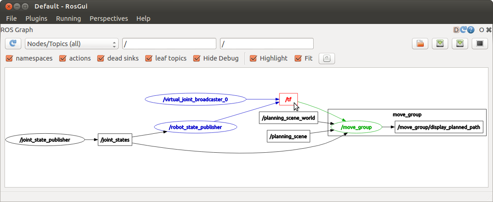

Introduction to ROS
====================
Overview
--------

`Robot Operating System`_ (ROS) is a collection of software frameworks for robot software developments. 
Although ROS is not an operatering system, it provides services designed for a heterogeneous computer cluster and a majority of the packges are open source. 
One of its main advantages is that the client libraries (C++ and Python) allow nodes written in different programming languages to communicate. 
It is a powerful tool embedded with hardware abstraction, low-level device control, 
implementation of commonly used functionality, message-passing between processes, and package management.
While here we will only list the basic (key) components that might be related to Senior Design Projects.

.. _Robot Operating System: http://wiki.ros.org/

Terminologies
-------------

In ROS, all resources (e.g., data from different sensors) are ``Messages`` of ``Nodes``. 
These ``Messages`` could be accessed and transmitted among ``Nodes`` as "Topics" (as well as ``Services`` and ``Actions``). 

- ``Node``: An executable file, can publish or subscribe a ``Topic``.
- ``Topic``: Nodes are communicating over a ``Topic``.
- ``Publish`` or ``Subscribe``: Broadcast or "listen to" the ``Message``

Their relation could be expressed in the following figure.

Writing a Publisher in Python
------------------------------

.. code-block:: python

    #!/usr/bin/env python

    import rospy
    from std_msgs.msg import String

    def talker():
        rospy.init_node('talker') 
        pub = rospy.Publisher('chatter', String, queue_size = 10) 
        rate = rospy.Rate(10) # 10hz

        while not rospy.is_shutdown():
          content = "welcome to EE175 %s"
          pub.publish(content) 
          rate.sleep() 

    if __name__ == '__main__':
        try:
            talker()
        except rospy.ROSInterruptException:
            pass
            

Now we are going to explain each sentence of the sample script. Please read carefully and try to write your own code.

- This first line makes sure your code is executed as a python script.
.. code-block:: python

    #!/usr/bin/env python
    
- As mentioned, ``rospy`` is the python client library that needs to be imported if you are writting a ROS Node.

.. code-block:: python

    import rospy
    
- This line imports a well-defined message type ``String`` that will be later used in ``rospy.Publisher``. You could find all information (as in the following figure) of a type of message by typing ``$message$ ros`` on google. Most of message types could be found at `std_msgs`_ or `_common_masgs`.

.. _std_msgs: http://wiki.ros.org/std_msgs
.. _common_msgs: https://wiki.ros.org/common_msgs

.. code-block:: python

    from std_msgs.msg import String
    
- Initialize the node with name ``talker``.

.. code-block:: python

    rospy.init_node('talker') 
    
- Declare a publisher that your node ``talker`` will publish messages to the topic ``chatter``. The format of the message is defined as ``String``, i.e. the topic using the message type ``String``. The ``queue_size`` limits the amount of queued messages if any subscriber is not receiving them fast enough.

.. code-block:: python

    pub = rospy.Publisher('chatter', String, queue_size = 10) 
    
- This loop is a fairly standard rospy construct: checking the ``rospy.is_shutdown()`` flag and then doing work. In this case, the "work" is a call to ``pub.publish(content)`` that publishes a string to our ``chatter`` topic. Keep in mind that the ``content`` has format ``String`` (consistent with what we declared in ``pub``). The loop calls ``rate.sleep()``, which sleeps just long enough to maintain the desired rate (10 hz in that script) through the loop.

.. code-block:: python

      while not rospy.is_shutdown():
          content = "welcome to EE175 %s"
          pub.publish(content) 
          rate.sleep() 
    

Writing a Subscriber in Python
------------------------------

.. code-block:: python

    #!/usr/bin/env python

    import rospy
    from std_msgs.msg import String

    def callback(data):
        rospy.loginfo(data.data) # Please check the previous figure to see why ".data" gives the content of "String"
 
 
    def talker():
        rospy.init_node('listener')
        rospy.Subscriber('chatter', String, callback)
        rospy.spin()

    if __name__ == '__main__':
        listener()

- Declare a subscriber that your node ``listener`` will subscribe messages from the topic ``chatter``. The format of the message is defined as ``String`` and the received data are stored in the ``callback`` function. spin() keeps python from exiting until this node is stopped

.. code-block:: python

    rospy.Subscriber('chatter', String, callback) 
    rospy.spin() 
    
The code for ``Subscriber`` is similar to ``Publisher``. The main difference is the ``Subscriber`` will call a ``callback`` function when new messages are received. 
Note that the ``callback`` is a void function, i.e. it can't return anything. 
So if we want to utilize the received message, we will introduce the Python ``Classes``. It provides a means of bundling data and functionality togther. 
Here we will give a simple example to show how to combine ``Publisher`` with ``Subscriber`` and how to commit data collected in ``callback`` function through the script.
(Note the code here is only for explaining the usage but make no sense in terms of control.)

.. code-block:: python

    #!/usr/bin/env python

    import rospy
    import numpy as np
    from nav_msgs.msg import Odometry
    from geometry_msgs.msg import Twist, Pose2D

    class Bot():
        def __init__(self):
            # Initializaiton
            N = 200
            self.vel = Twist()
            self.pose = Pose2D()

            rospy.init_node('dataTracker')
            self.pub = rospy.Publisher("/cmd_vel", Twist, queue_size =10)
            rospy.Subscriber("/odom", Odometry, self.odom_callback)
            self.rate = rospy.Rate(10)

            for i in range(N):
                self.controller(self.pose)
                self.rate.sleep()

        def controller(self, state):        
            self.vel.linear.x = -state.x
            self.vel.angular.z = 0.0
            self.pub.publish(self.vel)

        def odom_callback(self, data):
            self.pose.x = data.pose.pose.position.x # Please check the defination of message type "Odometry" to see why we could get the content in this way.
            self.pose.y = data.pose.pose.position.y

    if __name__ == '__main__':
        Bot()

In the script above, we show how to communicate with a robot and design a feedback controller for it using ROS. 
Firstly, we do initialization and propagate the system in the ``__init__``function. 
Once we initialized the ``Subscriber``, the data in ``odom_callback`` will keep updating its information according to the new received data from topic ``/odom``. 
So the variable ``pose`` will also keep updating. 
At every 0.01s (10 hz), when we run the ``controller`` function, it can use current ``pose`` as feedback information for control.
Then the control inputs are published to topic ``/cmd_vel``, which will be subsribed by the robot as current command.

Using ``rqt_graph``
-----------------------------

- ``rqt_graph`` is a good tool to clarify the relations among topics and nodes by providing a ROS communication graph. 
You could check whether your communication algorithm works or not. To use it, just open a new terminal and type ``rqt_graph``, an example is shown as follows.

Frequently-used Commands
------------------------

- ``roscore``: You must have a roscore running in order for ROS nodes to communicate. It will start up a `ROS Master`_, a `ROS Server`_ and a `rosout`_ loggin node.

.. _ROS Master: http://wiki.ros.org/Master
.. _ROS Server: http://wiki.ros.org/Parameter%20Server
.. _rosout: http://wiki.ros.org/rosout

- ``roslaunch $package_name$ $file.launch$``: is for easily launching multiple ROS nodes as well as setting parameters. A ``roslaunch`` will automatically start ``roscore``.
- ``rosnode list``: lists all active nodes that are currently running.
- ``rosnode info $node$``: show information of the node, e.g., publications; subscriptions.
- ``rostopic list``: print information about active topics
- ``rostopic echo $topic$``: print message to screen.
- ``rostopic type $topic$``: print topic type (message type)
- ``rosrun $package$ $executable$``:rosrun allows you to run an executable in an arbitrary package from anywhere without having to give its full path
